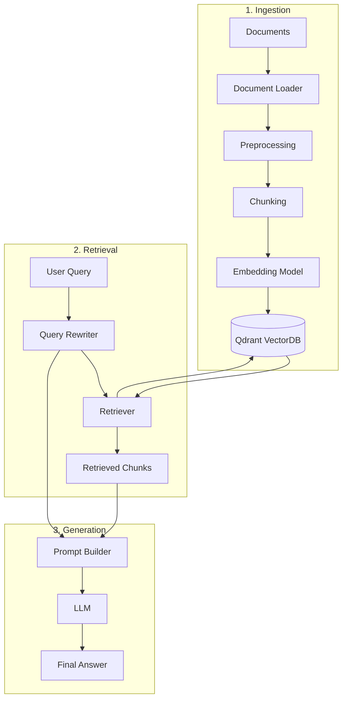

# RAG-For-Learning-Material-or-Documentation
This is supporting for students who study in VGU for documentation and ask/answer chatbot

## 1. Docker Setup

Build the container:

    docker build -t rag-learning-docs .

Run with Docker:

    docker run --rm -p 8000:8000 --env-file .env rag-learning-docs

Or use Docker Compose:

    docker compose up --build

Customize the exposed port or command as needed if your app entrypoint changes.

## 2. Knowledgable:
> _**Note**_: This must be understood when we want to build once for yourselve


### 2.1. Ingestion (Loader)
**Description:** 
> This function is for turning the all the documents (that update to system then load to the vector database) into markdown files: 

**New-Insight: We can use model from Gemini for better OCR -> from jpg or png to text** (Havent in production yet)

> [!NOTE]
> **Loader**
>
> **File destination:** `/ingestion/loader.py`
>
> **Input:** `file_path` or `user-input-file`
>
> **Process:**
> 1. Recieve Input of Users (File-Path, File-Name, URL)
> 2. Recognize the suffix-extension of the file-type (`.pdf`, `.txt`, `.csv`, `.png`, ...)
> 3. Using the libraries to convert all-types into `.md` file (MarkItDown, pdf-inspector, ocr-libs [future consideration])
> 4. Save the text into `output-scheme` and **output-file into output-directory**
>
> **Output:**
> - **Datatype:** `Struct`
> - **Output Scheme:**
>
> ```json
> {
>   "text": text,
>   "metadata": {
>     "source": source,
>     "file_path": file_path,
>     "file_type": file_type,
>     "loaded_at": load_time
>   }
> }
> ```

**Example**

```python
# create main.py 
from ingestion import FileLoader
file_path='file_path' # put path to file here

output=FileLoader(file_path=file_path).load()
```
### 2.2. Chunking
**Desription**
> The **Chunking** stage splits the loaded document into smaller pieces called **chunks**. These chunks are used as context windows for retrieval from the vector database

It will have 2 variable fixed `DEFAULT CHUNK SIZE` and `DEFAULT CHUNK OVERLAP`
- `DEFAULT CHUNK SIZE`: define the maximum number of characters contained in a single chunk
- `DEFAULT CHUNK OVERLAP`: define the number of characters shared between two consecutive chunks

**Example**

DEFAULT_CHUNK_SIZE = 1000
DEFAULT_CHUNK_OVERLAP = 200

The chunks will conceptually look like:

```
Chunk 1: [---------------------------------]
            1000 characters

Chunk 2:                [--------------------------------
                        1000 characters
                        <------ 200 - character overlap ------->

Chunk 3: 
                                        [---------------------
                                        1000 characters
```

**Note**: The overlap helps preserve contextual information between adjacent chunks and reduces the risk of losing important information at chunk boundaries

> [!NOTE]
> **Loader**
>
> **File destination:** `/chunking/chunker.py`
>
> **Input:** `doc` with `dictionary` datatype
>
> **Process:**
> 1. Receive the `text` and `metadata` from the Loader output.
> 2. Select a chunking strategy based on the document structure:
>    - **Fixed-Size Chunking:** Split text based on a fixed character/token limit.
>    - **Recursive Chunking:** Split text using hierarchical separators such as paragraphs, newlines, sentences, and words.
>    - **Markdown Chunking:** Split Markdown documents by headers first, then `recursively chunk` sections that exceed the configured chunk size.
> 3. Apply `DEFAULT_CHUNK_SIZE` and `DEFAULT_CHUNK_OVERLAP` to control the size of each chunk and preserve contextual information between consecutive chunks.
> 4. Generate metadata for each chunk, including the original document metadata, `chunk_index`, and `total_chunk`.
> 5. Return a list of chunk objects containing the chunked `text` and its corresponding `metadata`.
>
> **Output:**
> - **Datatype:** `Struct`
> - **Output Scheme:**
>
> ```json
> {
>   "text": text,
>   "metadata": {
>     "source": source,
>     "file_path": file_path,
>     "file_type": file_type,
>     "loaded_at": load_time,
>     "chunk_index": chunk_index,
>     "total_chunk": total_chunk
>   }
> }
> ```

### 2.3. VectorDB (Vector Store)
**Description**
>**Vector store (VectorDB)** stores embeddings (`fixed-dimension vectors`) and associated metadata for fast semantic retrieval. In this project `Qdrant` is the recommended store; other providers (Pinecone, Milvus, etc.) can be used with an adapter.

**Note:**
    - Keep **VECTOR_DIM** consistent with the embedding model to avoid errors
    - Use chunk ids stable across re-ingestion to avoid duplicates
    - Consider sharding/collections per-tenant for multi-tenancy

>[!NOTE]
> **Vector-Store**
>
> **File destination**
>   - `/vectordb/manager.py`  (wrapper around provider client)
>   - `/ingestion/` -> produces chunk objects to be inserted
>
> **Config / Environment (Input)**
>   - QDRANT_URL: URL to the Qdrant instance
>   - QDRANT_API_KEY: API key if hosted (optional)
>   - VECTORDB_COLLECTION: default collection name, e.g. "rag_docs"
>   - VECTOR_DIM: integer embedding dimension (must match embedding model)
>   - DISTANCE: similarity metric, e.g. "Cosine" or "Dot" or "Euclid"
>
> **Schema / Metadata**
> Each vector entry should include:
>   - id: stable id for the chunk (string)
>   - vector: embedding (list[float])
>   - payload / metadata: dictionary containing
>       - source: original file or URL
>       - file_path: path in storage
>       - chunk_index: integer
>       - total_chunks: integer
>       - loaded_at: iso timestamp
>       - any custom tags (e.g., topic, language)
>
> **Process**
>   1. Receive chunk objects from ingestion: {text, metadata}
>   2. Compute embedding using chosen model (ensure VECTOR_DIM)
>   3. Upsert vectors and metadata into collection
>   4. Provide a Retriever API that accepts query embeddings and returns top-k chunks
>
>**Example**
>```python
>
>    from qdrant_client import QdrantClient
>    from qdrant_client.http import models
>
>    client = QdrantClient(url=os.getenv("QDRANT_URL"), api_key=os.getenv("QDRANT_API_KEY"))
>    collection = os.getenv("VECTORDB_COLLECTION", "rag_docs")
>
>    # create collection if not exists
>    client.recreate_collection(
>        collection_name=collection,
>        vectors_config=models.VectorParams(size=int(os.getenv("VECTOR_DIM", 1536)), distance=models.Distance.COSINE),
>    )
>
>   # upsert a single chunk
>    point = models.PointStruct(
>        id="doc1-chunk-0",
>        vector=embedding,  # list[float]
>        payload={
>            "source": "file.pdf",
>            "file_path": "/data/file.pdf",
>            "chunk_index": 0,
>            "total_chunks": 10,
>            "text": chunk_text,
>        },
>    )
>    client.upsert(collection_name=collection, points=[point])
>
>   #search
>   results = client.search(collection_name=collection, query_vector=query_embedding, limit=5)
>   for res in results:
>       print(res.id, res.payload.get("file_path"), res.score)
> 
>```
>
> **Retriever contract**
> Expose a simple Retriever interface:
>   - build_index(chunks: List[Chunk]) -> None
>   - query(query_text: str, top_k: int = 5) -> List[Chunk]
>
_**Implementation should handle batching upserts, retries, and backoff for network errors.**_


# References:
## [1] MarkItDown - Repo [Turn file-format to .md file]
!!! url 
    https://github.com/microsoft/markitdown

## [2] Qdrant: Vector Database - Repo [store and embedded the data]
!!!url 
    https://github.com/qdrant/qdrant 
    https://qdrant.tech/documentation/clients/python/

## [3] pdf_inspector - Repo [99% valid-rate from turning `.pdf` to `markdown-file`]
!!!url 
    https://github.com/firecrawl/pdf-inspector

## [4] Unlimited OCR (near future add-in)