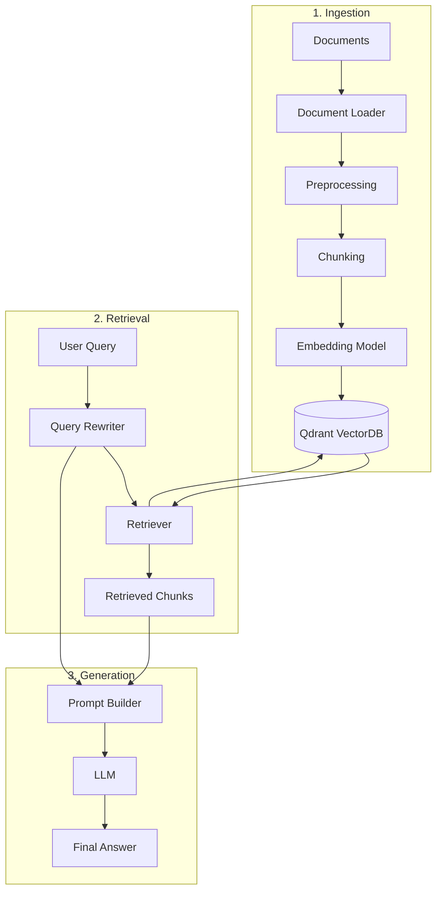

# RAG-For-Learning-Material-or-Documentation
This is supporting for students who study in VGU for documentation and ask/answer chatbot

## 1. Docker Setup

Build the container:

    docker build -t rag-learning-docs .

Run with Docker:

    docker run --rm -p 8000:8000 --env-file .env rag-learning-docs

Or use Docker Compose:

    docker compose up --build

Customize the exposed port or command as needed if your app entrypoint changes.

## 2. Knowledgable:
> _**Note**_: This must be understood when we want to build once for yourselve


### 2.1. Ingestion (Loader)
**Description:** 
> This function is for turning the all the documents (that update to system then load to the vector database) into markdown files: 

**New-Insight: We can use model from Gemini for better OCR -> from jpg or png to text** (Havent in production yet)

> [!NOTE]
> **Loader**
>
> **File destination:** `/ingestion/loader.py`
>
> **Input:** `file_path` or `user-input-file`
>
> **Process:**
> 1. Recieve Input of Users (File-Path, File-Name, URL)
> 2. Recognize the suffix-extension of the file-type (`.pdf`, `.txt`, `.csv`, `.png`, ...)
> 3. Using the libraries to convert all-types into `.md` file (MarkItDown, pdf-inspector, ocr-libs [future consideration])
> 4. Save the text into `output-scheme` and **output-file into output-directory**
>
> **Output:**
> - **Datatype:** `Struct`
> - **Output Scheme:**
>
> ```json
> {
>   "text": text,
>   "metadata": {
>     "source": source,
>     "file_path": file_path,
>     "file_type": file_type,
>     "loaded_at": load_time
>   }
> }
> ```

**Example**

```python
# create main.py 
from ingestion import FileLoader
file_path='file_path' # put path to file here

output=FileLoader(file_path=file_path).load()
```
### 2.2. Chunking
**Desription**
> The **Chunking** stage splits the loaded document into smaller pieces called **chunks**. These chunks are used as context windows for retrieval from the vector database

It will have 2 variable fixed `DEFAULT CHUNK SIZE` and `DEFAULT CHUNK OVERLAP`
- `DEFAULT CHUNK SIZE`: define the maximum number of characters contained in a single chunk
- `DEFAULT CHUNK OVERLAP`: define the number of characters shared between two consecutive chunks

**Example**

DEFAULT_CHUNK_SIZE = 1000
DEFAULT_CHUNK_OVERLAP = 200

The chunks will conceptually look like:

```
Chunk 1: [---------------------------------]
            1000 characters

Chunk 2:                [--------------------------------
                        1000 characters
                        <------ 200 - character overlap ------->

Chunk 3: 
                                        [---------------------
                                        1000 characters
```

**Note**: The overlap helps preserve contextual information between adjacent chunks and reduces the risk of losing important information at chunk boundaries

> [!NOTE]
> **Loader**
>
> **File destination:** `/chunking/chunker.py`
>
> **Input:** `doc` with `dictionary` datatype
>
> **Process:**
> 1. Receive the `text` and `metadata` from the Loader output.
> 2. Select a chunking strategy based on the document structure:
>    - **Fixed-Size Chunking:** Split text based on a fixed character/token limit.
>    - **Recursive Chunking:** Split text using hierarchical separators such as paragraphs, newlines, sentences, and words.
>    - **Markdown Chunking:** Split Markdown documents by headers first, then `recursively chunk` sections that exceed the configured chunk size.
> 3. Apply `DEFAULT_CHUNK_SIZE` and `DEFAULT_CHUNK_OVERLAP` to control the size of each chunk and preserve contextual information between consecutive chunks.
> 4. Generate metadata for each chunk, including the original document metadata, `chunk_index`, and `total_chunk`.
> 5. Return a list of chunk objects containing the chunked `text` and its corresponding `metadata`.
>
> **Output:**
> - **Datatype:** `Struct`
> - **Output Scheme:**
>
> ```json
> {
>   "text": text,
>   "metadata": {
>     "source": source,
>     "file_path": file_path,
>     "file_type": file_type,
>     "loaded_at": load_time,
>     "chunk_index": chunk_index,
>     "total_chunk": total_chunk
>   }
> }
> ```


# References:
## [1] MarkItDown - Repo [Turn file-format to .md file]
!!! url https://github.com/microsoft/markitdown

## [2] Qdrant: Vector Database - Repo [store and embedded the data]
!!!url https://github.com/qdrant/qdrant

## [3] pdf_inspector - Repo [99% valid-rate from turning `.pdf` to `markdown-file`]
!!!url https://github.com/firecrawl/pdf-inspector