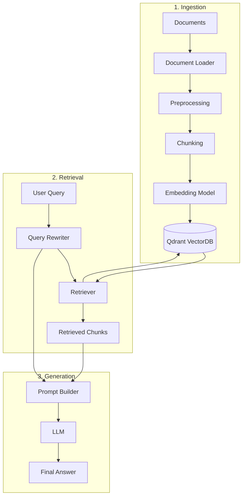
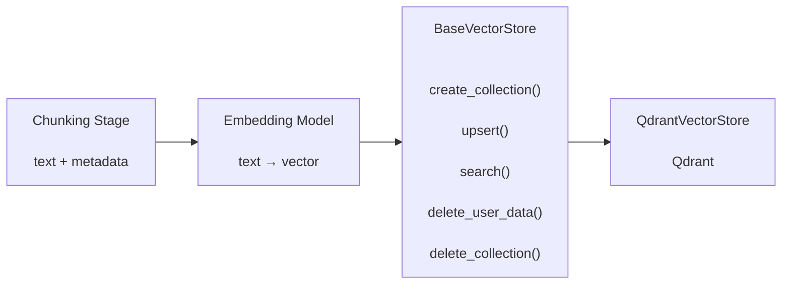
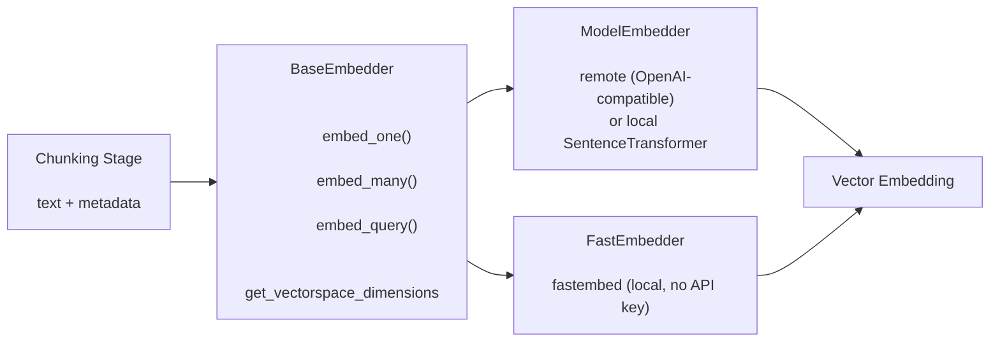

# RAG-For-Learning-Material-or-Documentation

This is supporting for students who study in VGU for documentation and ask/answer chatbot

## 1. Docker Setup

Build the container:

    docker build -t rag-learning-docs .

Run with Docker:

    docker run --rm -p 8000:8000 --env-file .env rag-learning-docs

Or use Docker Compose:

    docker compose up --build

Customize the exposed port or command as needed if your app entrypoint changes.

## 2. Knowledgable:

> _**Note**_: This must be understood when we want to build once for yourselve



### 2.1. Ingestion (Loader)

**Description:**

> This function is for turning the all the documents (that update to system then load to the vector database) into markdown files:

**New-Insight: We can use model from Gemini for better OCR -> from jpg or png to text** (Havent in production yet)

> [!NOTE] > **Loader**
>
> **File destination:** `/ingestion/loader.py`
>
> **Input:** `file_path` or `user-input-file`
>
> **Process:**
>
> 1. Recieve Input of Users (File-Path, File-Name, URL)
> 2. Recognize the suffix-extension of the file-type (`.pdf`, `.txt`, `.csv`, `.png`, ...)
> 3. Using the libraries to convert all-types into `.md` file (MarkItDown, pdf-inspector, ocr-libs [future consideration])
> 4. Save the text into `output-scheme` and **output-file into output-directory**
>
> **Output:**
>
> - **Datatype:** `Struct`
> - **Output Scheme:**
>
> ```json
> {
>   "text": text,
>   "metadata": {
>     "source": source,
>     "file_path": file_path,
>     "file_type": file_type,
>     "loaded_at": load_time
>   }
> }
> ```

**Example**

```python
# create main.py
from ingestion import FileLoader
file_path='file_path' # put path to file here

output=FileLoader(file_path=file_path).load()
```

### 2.2. Chunking

**Desription**

> The **Chunking** stage splits the loaded document into smaller pieces called **chunks**. These chunks are used as context windows for retrieval from the vector database

It will have 2 variable fixed `DEFAULT CHUNK SIZE` and `DEFAULT CHUNK OVERLAP`

- `DEFAULT CHUNK SIZE`: define the maximum number of characters contained in a single chunk
- `DEFAULT CHUNK OVERLAP`: define the number of characters shared between two consecutive chunks

**Example**

DEFAULT_CHUNK_SIZE = 1000
DEFAULT_CHUNK_OVERLAP = 200

The chunks will conceptually look like:

```
Chunk 1: [---------------------------------]
            1000 characters

Chunk 2:                [--------------------------------
                        1000 characters
                        <------ 200 - character overlap ------->

Chunk 3:
                                        [---------------------
                                        1000 characters
```

**Note**: The overlap helps preserve contextual information between adjacent chunks and reduces the risk of losing important information at chunk boundaries

> [!NOTE] > **Loader**
>
> **File destination:** `/chunking/chunker.py`
>
> **Input:** `doc` with `dictionary` datatype
>
> **Process:**
>
> 1. Receive the `text` and `metadata` from the Loader output.
> 2. Select a chunking strategy based on the document structure:
>    - **Fixed-Size Chunking:** Split text based on a fixed character/token limit.
>    - **Recursive Chunking:** Split text using hierarchical separators such as paragraphs, newlines, sentences, and words.
>    - **Markdown Chunking:** Split Markdown documents by headers first, then `recursively chunk` sections that exceed the configured chunk size.
> 3. Apply `DEFAULT_CHUNK_SIZE` and `DEFAULT_CHUNK_OVERLAP` to control the size of each chunk and preserve contextual information between consecutive chunks.
> 4. Generate metadata for each chunk, including the original document metadata, `chunk_index`, and `total_chunk`.
> 5. Return a list of chunk objects containing the chunked `text` and its corresponding `metadata`.
>
> **Output:**
>
> - **Datatype:** `Struct`
> - **Output Scheme:**
>
> ```json
> {
>   "text": text,
>   "metadata": {
>     "source": source,
>     "file_path": file_path,
>     "file_type": file_type,
>     "loaded_at": load_time,
>     "chunk_index": chunk_index,
>     "total_chunk": total_chunk
>   }
> }
> ```

### 2.3. VectorDB (Vector Store)

**Description**

> The **Vector Store** is responsible for storing document embeddings and their ssociated metadata so that relevant chunks can be retrieved efficiently during the RAG process.
>
> In this project, **Qdrant** is used as the vector database. The implementation provides a provider-independent `BaseVectorStore` interface and a `QdrantVectorStore` implementation.
>
> The Vector Store also supports **tenant isolation**, where each `user_id` receives an isolated collection and all search/delete operations are scoped to that user.

> [!NOTE] > **Vector Store**
>
> **File destination:**
>
> - `/vectordb/vector_store.py`
>
> **Input:**
>
> - `chunks`: list of chunk objects produced by the Chunking stage
> - `user_id`: identifier used for tenant isolation
> - `query_vector`: embedding vector generated from the user's query (_this is for searching function_)
>
> **Configuration / Environment:**
>
> - `QDRANT_URL`: URL of the Qdrant instance
> - `QDRANT_API_KEY`: API key for hosted Qdrant (optional)
> - `VECTOR_DIM`: dimension of the embedding vector
> - `DISTANCE`: similarity metric used by Qdrant, e.g. `Cosine`, `Dot`, or `Euclid` (in this project we use COSINE DISTANCE)
>
> **Process:**
>
> 1. Receive chunk objects from the Chunking stage.
> 2. Create or retrieve a Qdrant collection for the corresponding `user_id`.
> 3. Validate that each chunk contains an embedding vector.
> 4. Store the embedding together with the chunk text and metadata.
> 5. Attach `user_id` to the payload to enforce tenant isolation.
> 6. Provide a similarity-search interface for retrieving the most relevant chunks.
> 7. Support deletion of either all data belonging to a user or the user's
>    entire collection.
>
> **Output:**
>
> - **Datatype:** `List[Dict]`
> - **Output Scheme:**
>
> ```json
> {
>   "id": "doc1-chunk-0",
>   "score": 0.9234,
>   "payload": {
>     "text": "chunk text",
>     "source": "file.pdf",
>     "file_path": "/data/file.pdf",
>     "file_type": "pdf",
>     "chunk_index": 0,
>     "total_chunk": 10,
>     "loaded_at": "2026-08-03T10:00:00",
>     "user_id": "student_001"
>   }
> }
> ```

**Vector Store Architecture**
The Vector Store is implemented using an abstract interface so that the underlying vector database can be replaced without changing the RAG pipeline.



### 2.4. Embedded

**Notation:**

`Dimension of vector space` : This is the number of neural of last layer of the hidden layer when goes to output layer for final calculation.

**Description:**

> The **Embedding** stage turns the chunked text into high-dimensional **vectors** (embeddings) that capture the semantic meaning of the text. These vectors are then stored in the Vector Store and later used to compute the similarity between a user query and each chunk during retrieval.

_Input:_

- `model`: model that use for embed to vectordb purpose
- `base_url`: url connect to that model that can be `local` also for developing purpose
- `api_key`: key access to the model embedded that already authorize

_Processing:_

We have 2 type of processing:

1. Model-Embedder

2. Fast-Embedder (from `fastembed` library [this-new])

> [!NOTE]:
>
> It just different in model usage only 
>
> - With Fast-Embedder -> we do not need to import model/api_key/url
>
> - With Model-Embedder -> we must include all the model/api_key/url -> for authentication
> 
> The processing in general is the same

> [!NOTE] > **Embedder**
>
> **File destination:**
>
> - `/src/embeddings/embedder.py`
>
> **Input:**
>
> - `chunks`: list of chunk objects produced by the Chunking stage (each chunk contains `text` and `metadata`)
> - `query`: the user query string (_this is for embedding a query before searching_)
>
> **Implementations:**
>
> - **`BaseEmbedder`:** abstract interface that defines `embed_one()`, `embed_many()`, `embed_query()` and `get_vectorspace_dimensions`.
> - **`ModelEmbedder`:** connects to a remote OpenAI-compatible embedding endpoint via `base_url` + `api_key`, or loads a local model with `SentenceTransformer` when `base_url="local"`.
> - **`FastEmbedder`:** local, API-key-free embedder backed by the `fastembed` library, used as a fallback when no API key is configured (default model: `BAAI/bge-small-en-v1.5`).
>
> **Configuration / Environment:**
>
> - `EMBEDDING_MODEL`: the embedding model name (e.g. `bge-m3`, `text-embedding-3-small`, ...)
> - `EMBEDDING_BASE_URL`: the endpoint of the OpenAI-compatible embedding server, or the reserved value `local`
> - `EMBEDDING_API_KEY`: the API key used for authentication (optional when using `local` or `FastEmbedder`)
> - `VECTOR_DIM`: must match the output dimension of the chosen model
>
> **Process:**
>
> 1. Receive chunk objects from the Chunking stage.
> 2. Collect the `text` of each chunk into a list.
> 3. Embed the texts through `_batch_embed()` (a true batch call when the underlying client supports it).
> 4. Attach each produced vector to its chunk under the key `vector`.
> 5. Expose `embed_query()` to embed the user query separately, since some models use different instructions for queries vs documents.
> 6. Expose `get_vectorspace_dimensions` so the Vector Store can create a collection with the correct `VECTOR_DIM`.
>
> **Output:**
>
> - **Datatype:** `List[Dict]` *(the input chunks mutated with their vectors)*
> - **Output Scheme:**
>
> ```json
> {
>   "text": "chunk text",
>   "metadata": {
>     "source": "file.pdf",
>     "file_path": "/data/file.pdf",
>     "file_type": "pdf",
>     "chunk_index": 0,
>     "total_chunk": 10
>   },
>   "vector": [0.0123, -0.0456, 0.0789, "..."]
> }
> ```

**Embedder Architecture**
Both embedders inherit from the abstract `BaseEmbedder` interface, so the embedding backend can be swapped without touching the rest of the RAG pipeline.



**Workflows:**

```python
from src.embeddings import FastEmbedder, ModelEmbedder

# 1. Fast-Embedder -> local, no api_key / base_url needed
fast_embedder = FastEmbedder(model="BAAI/bge-small-en-v1.5")

dim = fast_embedder.get_vectorspace_dimensions


# 2. Model-Embedder -> remote endpoint
model_embedder = ModelEmbedder(
    model="bge-m3",
    base_url="http://localhost:6333",  # or your embedding server URL
    api_key="your-api-key",
)

# 3. Model-Embedder -> local model for developing purpose
local_embedder = ModelEmbedder(
    model="BAAI/bge-small-en-v1.5",
    base_url="local",
)

# Embed a batch of chunks (adds "vector" to each chunk dict)
chunks = [{"text": "The cell membrane is selectively permeable.", "metadata": {}}]
embedded_chunks = model_embedder.embed_many(chunks)

# Embed a single user query for searching
query_vector = model_embedder.embed_query("What is the cell membrane?")
```


# References

## [1] MarkItDown — Repo

> Turn file formats into `.md` files.
>
> **URL:** https://github.com/microsoft/markitdown

## [2] Qdrant — Vector Database

> Store and embed vector data.
>
> **Repository:** https://github.com/qdrant/qdrant > **Python Client Documentation:** https://qdrant.tech/documentation/clients/python/

## [3] pdf_inspector — Repo

> 99% valid-rate for converting `.pdf` files to Markdown.
>
> **URL:** https://github.com/firecrawl/pdf-inspector

## [4] PaddleOCR — OCR Engine

> Near-future add-in for OCR processing of scanned/image-based documents.
>
> **URL:** https://github.com/PaddlePaddle/PaddleOCR

## [5] Unlimited OCR [Near future add-in]

> [!NOTE]
> OCR support for scanned PDFs and image-based documents.
> Planned as a fallback when MarkItDown / pdf_inspector cannot
> extract the document content reliably.

## [6] Conventional Commits

> A specification for adding human and machine-readable meaning to commit messages.
>
> **URL:** https://www.conventionalcommits.org/en/v1.0.0/
