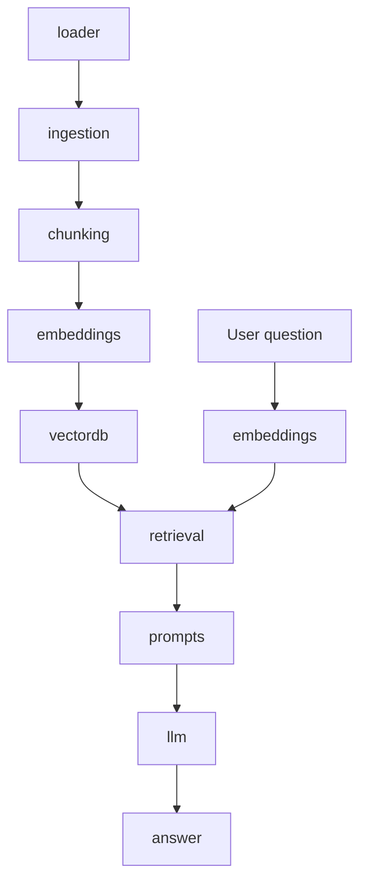

# R.A.G (Retrieval-Augmented Generation)

> Vietnamese version: Tạo sinh tăng cường truy xuất

## 1. What is R.A.G ?

Instead of asking an `LLM` from memory, you first fetch `relevant chunks` from your own documents, then pass those chunks as context to the `LLM` so it answers based on your data

> Short: tạo ngữ cảnh - sau đó áp đặt câu trả lời theo hoàn cảnh trên -> các câu hỏi tiếp theo sẽ tuân theo hoàn cảnh.

## 2. Build Order:

- `config.yaml`: define your settings first
- `ingesion/loader.py`: get raw text in [loader.md](loader).
- `chunking/chunker.py`: split it [chunker.md](chunker)
- `embeddings/embedder.py`: vectorize it [embedder.md](embedder)
- `vectordb/vector_store.py`: store it [vector_store.md](vector_store)
- `retrieval/retriever.py`: query it [retriever.md](retriever)
- `prompts/prompt_templates.py`: format it [prompt_templates.md](prompt_templates)
- `llm/llm_client.py`: generate answer [llm_client.md](llm_client)
- `api/routes.py`: expose it [routes.md](routes)
- `main.py`: wire everything together

## 3. Data Flow:

