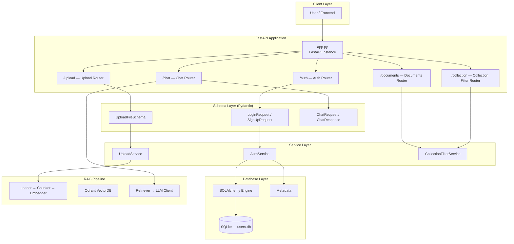
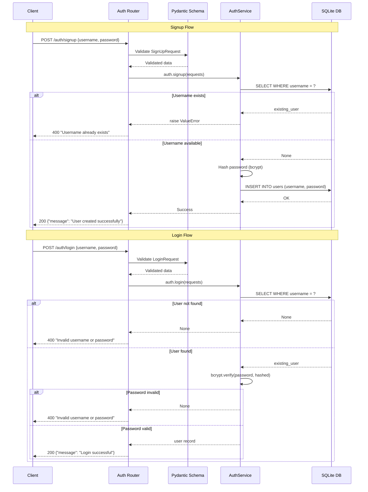
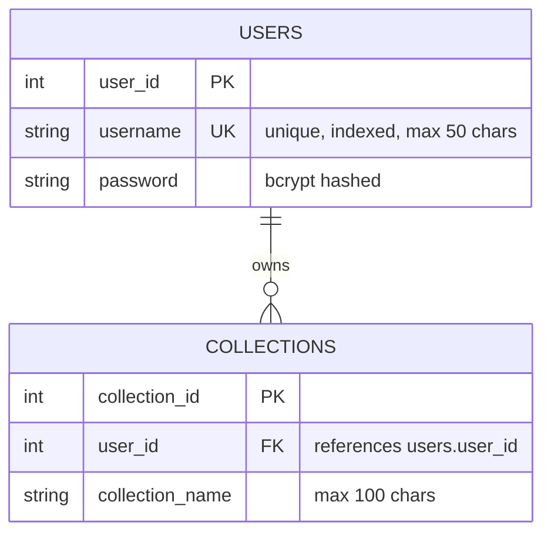
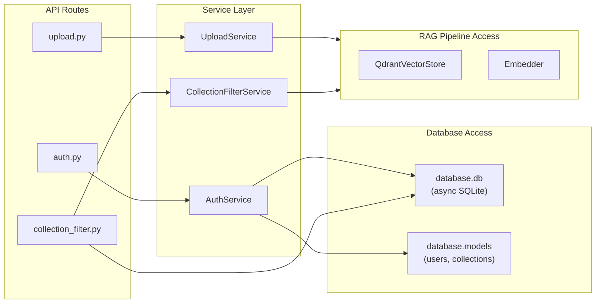
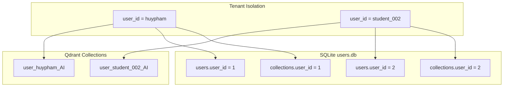

# System Design — API Routes, Database Models & Database Routes

## 1. Architecture Overview



---

## 2. API Routes

### 2.1 Route Registration

All routers are mounted onto the FastAPI `app` instance in `src/api/app.py`:

```python
from fastapi import FastAPI
from src.api.routes.auth import router as auth_router

app = FastAPI()
app.include_router(auth_router)
```

> **Current status:** Only `auth_router` is registered. The remaining routers (`chat`, `upload`, `documents`, `collection_filter`) are defined but not yet mounted — they are work-in-progress.

### 2.2 Route Table

| Router              | Prefix        | Tag            | Method     | Endpoint  | Handler    | Schema In          | Schema Out         | Status      |
| ------------------- | ------------- | -------------- | ---------- | --------- | ---------- | ------------------ | ------------------ | ----------- |
| `auth`              | `/auth`       | Authentication | POST       | `/signup` | `signup()` | `SignUpRequest`    | `{"message": ...}` | Implemented |
| `auth`              | `/auth`       | Authentication | POST       | `/login`  | `login()`  | `LoginRequest`     | `{"message": ...}` | Implemented |
| `chat`              | `/chat`       | Chat           | POST       | `/query`  | —          | `ChatRequest`      | `ChatResponse`     | Planned     |
| `upload`            | `/upload`     | Upload         | POST       | `/file`   | —          | `UploadFileSchema` | —                  | Planned     |
| `documents`         | `/docs`       | Documents      | GET        | `/list`   | —          | —                  | `List[Document]`   | Planned     |
| `collection_filter` | `/collection` | Collection     | GET/DELETE | `/filter` | —          | —                  | —                  | Planned     |

### 2.3 Auth Route Workflow



### 2.4 Schema Definitions

**`src/api/schemas/auth.py`**

| Class           | Fields                           | Constraints       |
| --------------- | -------------------------------- | ----------------- |
| `LoginRequest`  | `username: str`, `password: str` | `password` max 72 |
| `LoginResponse` | `username: str`, `password: str` | —                 |
| `SignUpRequest` | `username: str`, `password: str` | `password` max 72 |

**`src/api/schemas/upload.py`**

| Class              | Fields                                                                                   |
| ------------------ | ---------------------------------------------------------------------------------------- |
| `UploadFileSchema` | `file: bytes`, `username: str`, `filename: str`, `content: str`, `upload_date: datetime` |

---

## 3. Database Models

### 3.1 Database Configuration

**File:** `src/api/database/db.py`

| Component   | Value / Type                               |
| ----------- | ------------------------------------------ |
| Engine      | SQLite (`sqlite:///./users.db`)            |
| Database    | `databases.Database` (async wrapper)       |
| Metadata    | `sqlalchemy.MetaData()` (schema container) |
| Engine Sync | `sqlalchemy.create_engine(DATABASE_URL)`   |

> **Purpose:** SQLite is used for local development. The `databases` library provides async support on top of SQLAlchemy's synchronous engine.

### 3.2 Entity-Relationship Diagram



### 3.3 Table Definitions

**`users` table** — `src/api/database/models.py`

| Column     | Type         | Constraints                      |
| ---------- | ------------ | -------------------------------- |
| `user_id`  | `Integer`    | Primary Key, Auto-increment      |
| `username` | `String(50)` | UNIQUE, NOT NULL, Indexed        |
| `password` | `String`     | NOT NULL (bcrypt hash, up to 72) |

**`collections` table** — `src/api/database/models.py`

| Column            | Type          | Constraints                    |
| ----------------- | ------------- | ------------------------------ |
| `collection_id`   | `Integer`     | Primary Key, Auto-increment    |
| `user_id`         | `Integer`     | NOT NULL, FK → `users.user_id` |
| `collection_name` | `String(100)` | NOT NULL                       |

### 3.4 ORM Base

**File:** `src/api/database/models/base.py`

```python
from sqlalchemy.orm import DeclarativeBase

class Base(DeclarativeBase):
    pass
```

> Note: The current model definitions use SQLAlchemy `Table` objects (Core approach), not the ORM declarative style. The `Base` class is prepared for future ORM migration.

---

## 4. Database Routes (Service Layer)

### 4.1 Service Architecture



### 4.2 AuthService

**File:** `src/api/services/auth.py`

| Method       | DB Operation                       | Description                               |
| ------------ | ---------------------------------- | ----------------------------------------- |
| `__init__()` | `metadata.create_all(engine)`      | Auto-create tables on first init          |
| `signup()`   | `SELECT` → check unique → `INSERT` | Register user with bcrypt-hashed password |
| `login()`    | `SELECT WHERE username = ?`        | Verify credentials via `passlib.bcrypt`   |

**Key Implementation Details:**

- Passwords are hashed using `passlib.context.CryptContext(schemes=["bcrypt"])`
- Duplicate usernames are rejected at the service layer (ValueError → HTTP 400)
- All DB operations are `async` using the `databases` library

### 4.3 UploadService (Planned)

**File:** `src/api/services/upload.py`

Expected workflow:

```
Client → POST /upload/file
  → Validate UploadFileSchema
  → Ingest file (FileLoader)
  → Chunk document (MarkDownChunker)
  → Embed chunks (Embedder)
  → Upsert to Qdrant (QdrantVectorStore)
  → Store metadata in SQLite (collections table)
```

### 4.4 CollectionFilterService (Planned)

**File:** `src/api/services/collection_filter.py`

Expected workflow:

```
Client → GET /collection/filter?user_id=X&collection=Y
  → Query SQLite for collection metadata
  → Query Qdrant for vector data (filtered by user_id)
  → Return combined results

Client → DELETE /collection/filter?id=X
  → Delete from Qdrant (delete_user_data or delete_collection)
  → Delete from SQLite collections table
```

---

## 5. Multi-Tenant Isolation

All data access is scoped by `user_id`:



**Qdrant Collection Naming Convention:**

```
user_{user_id}_{collection_name}
# Example: user_huypham_AI
```

**Filter Enforcement:**

- Every Qdrant `search()`, `delete_user_data()`, and `delete_collection()` call includes a `user_id` filter via `_build_user_filter()`
- The `user_id` field is injected into every point payload on `upsert()`

---

## 6. Data Flow Summary

### 6.1 Authentication Flow

```
POST /auth/signup → SignUpRequest → AuthService → SQLite (users table)
POST /auth/login  → LoginRequest  → AuthService → SQLite (users table) → bcrypt verify
```

### 6.2 Ingestion Flow (via Upload Service)

```
POST /upload/file → UploadFileSchema
  → FileLoader.load()
  → MarkDownChunker.chunk()
  → Embedder.embed_many()
  → QdrantVectorStore.upsert()
  → SQLite (collections table)
```

### 6.3 Query Flow (via Chat Service)

```
POST /chat/query → ChatRequest
  → Embedder.embed_query()
  → QdrantRetriever.retrieve() → QdrantVectorStore.search()
  → PromptTemplate.build()
  → LLMClient.generate()
  → ChatResponse
```

---

## 7. Tech Stack Summary

| Layer          | Technology                                  | Purpose                          |
| -------------- | ------------------------------------------- | -------------------------------- |
| API Framework  | FastAPI + Uvicorn                           | HTTP server & routing            |
| Validation     | Pydantic v2                                 | Request/response schemas         |
| Auth Passwords | passlib + bcrypt                            | Password hashing & verification  |
| Relational DB  | SQLite + SQLAlchemy (async via `databases`) | User & collection metadata       |
| Vector DB      | Qdrant (via `qdrant-client`)                | Document embeddings & similarity |
| Embeddings     | fastembed / sentence-transformers / OpenAI  | Text → vector                    |
| LLM            | OpenAI-compatible (via `openai` SDK)        | Answer generation                |
| Config         | OmegaConf + YAML                            | Settings management              |

---

## 8. Directory Structure

```
src/api/
├── app.py                          # FastAPI app & router registration
├── database/
│   ├── db.py                       # SQLite engine, database, metadata
│   ├── models.py                   # Table definitions (users, collections)
│   └── models/
│       ├── base.py                 # DeclarativeBase (future ORM)
│       ├── users.py                # (empty — planned ORM model)
│       └── collections.py          # (empty — planned ORM model)
├── routes/
│   ├── auth.py                     # POST /auth/signup, /auth/login
│   ├── chat.py                     # (empty — planned)
│   ├── upload.py                   # (empty — planned)
│   ├── documents.py                # (empty — planned)
│   └── collection_filter.py        # (empty — planned)
├── schemas/
│   ├── auth.py                     # LoginRequest, SignUpRequest
│   ├── upload.py                   # UploadFileSchema
│   ├── chat.py                     # (empty — planned)
│   ├── documents.py                # (empty — planned)
│   └── collection_filter.py        # (empty — planned)
└── services/
    ├── auth.py                     # AuthService (signup, login)
    ├── upload.py                   # (empty — planned)
    └── collection_filter.py        # (empty — planned)
```

---

## 9. Planned Improvements

| Area                | Current State             | Planned Change                                  |
| ------------------- | ------------------------- | ----------------------------------------------- |
| Router Registration | Only `auth` mounted       | Mount all 5 routers in `app.py`                 |
| ORM Migration       | SQLAlchemy Core (`Table`) | Migrate to ORM models via `Base` declarative    |
| JWT Auth            | None                      | Add JWT token generation & middleware           |
| Collection CRUD     | Empty service             | Implement full CRUD for Qdrant collections      |
| Chat Service        | Empty service             | Wire `AskAndAnswer` pipeline to API             |
| Upload Service      | Empty service             | Wire `FileLoader` → `Chunker` → `Embedder` → DB |
| Database Migrations | `metadata.create_all()`   | Add Alembic for schema versioning               |
| Rate Limiting       | None                      | Add request throttling per user                 |
